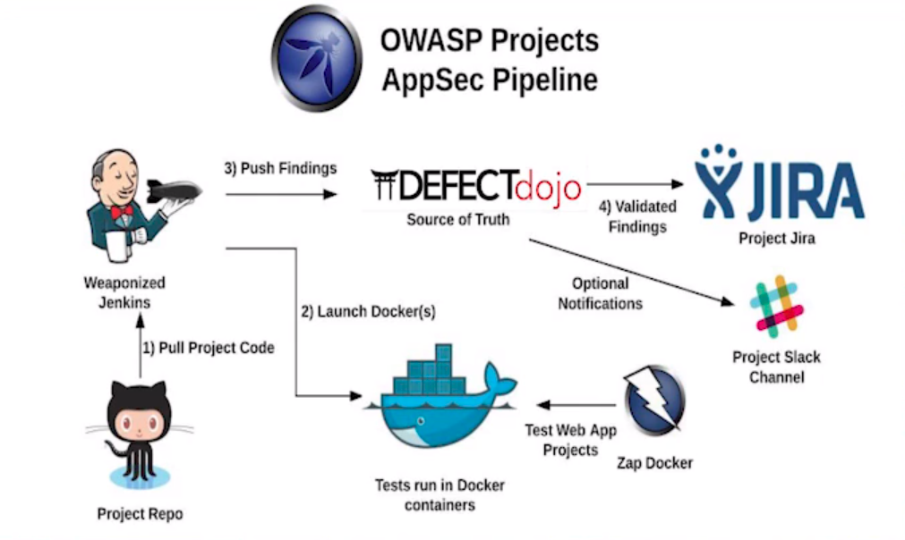
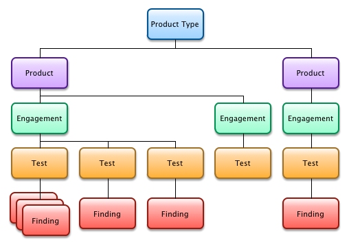

Riyaz Walikar | @riyazwalikar | @wincmdfu

## About Me

- Riyaz Walikar | @riyazwalikar | @wincmdfu
- Chief Offensive Security Officer at Appsecco (@appseccouk)
- Blog at https://blog.appsecco.com and https://ibreak.software
- One of OWASP Bangalore & null Bangalore Leader

## Problem Statement

<ul align="left">
<li class="fragment">
How do security testing teams manage discovered vulnerabilities?</li>
<li class="fragment">
How do security testing teams generate reports?
</li>
<li class="fragment">
How do security testing teams see the vulnerabilities discovered over a period of time / perform analytics?
</li>
</ul>

## OWASP DefectDojo

An open source OWASP Flagship mature project that allows you to manage your application security program, maintain product and application information, schedule scans, triage vulnerabilities and push findings into defect trackers.

Written by Greg Anderson

## Stack

- DefectDojo is written in Python Django
- Runs on gunicorn python server
- Backend is a MySQL database

## Where does DefectDojo Fit

## DefectDojo  Models

- Working in DefectDojo starts with a `Product Type`
- Each Product Type can have one of more `Products`
- Each Product can have one or more `Engagements`
- Each Engagement can have one more `Tests`
- Each Test can have one or more `Findings`

## Demo

## References

- [DefectDojo on OWASP][1]
- [DefectDojo Source on Github][2]
- [DefectDojo Readthedocs][3]
- [DefectDojo SwaggerHub][4]
- [DefectDojo Playground/Demosite][5]
- [Ready to Run Production Ready DefectDojo docker][6]
- [Making Vulnerability Management Less Painful with OWASP DefectDojo][7]

[1]: https://www.owasp.org/index.php/OWASP_DefectDojo_Project
[2]: https://github.com/DefectDojo/django-DefectDojo/
[3]: https://defectdojo.readthedocs.io/en/latest/
[4]: https://app.swaggerhub.com/apis/DefectDojo/defect-dojo_api_v_2/1.0.0
[5]: https://defectdojo.herokuapp.com/
[6]: https://github.com/aaronweaver/docker-DefectDojo
[7]: https://www.youtube.com/watch?v=7FX0vZ245-I